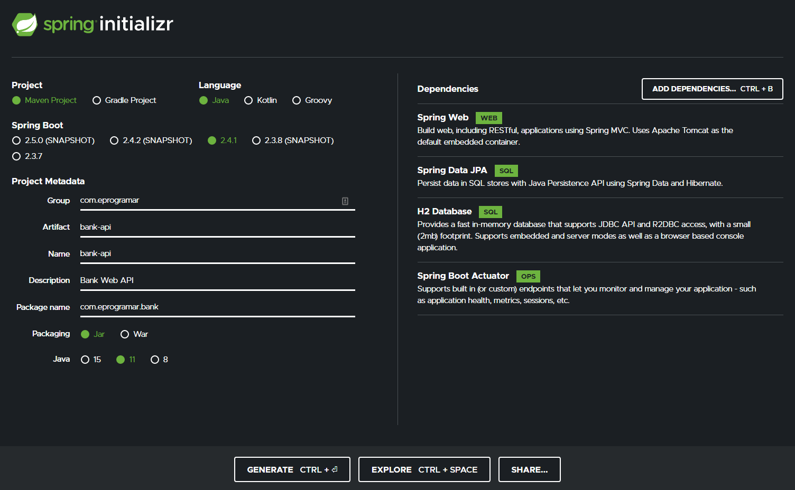
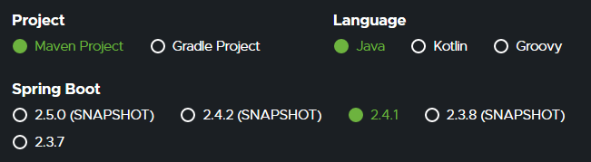
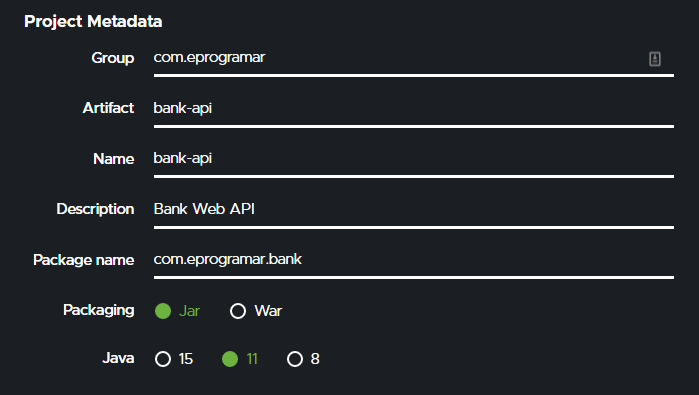
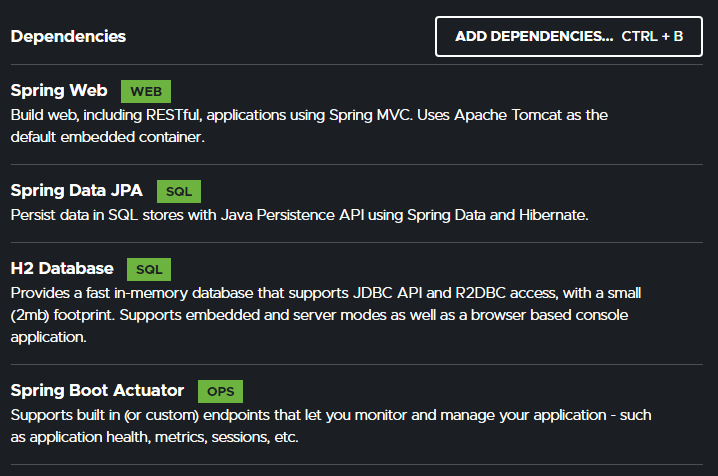
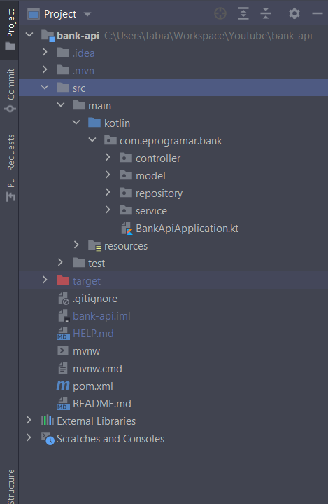

# Projeto

[Home](../README.md)

Como **Requisito** para seguir este tutorial é preciso ter instalado o Java a partir da versão 11, Maven 3 e uma IDE como Visual Studio Code ou IntelliJ, eu aconsenlho Instalar a versão **Community** que é gratuita e atende completamente este tutorial.

o IntelliJ pode ser baixado pelo site da **JetBrains**:   
[https://www.jetbrains.com/pt-br/idea/download/](https://www.jetbrains.com/pt-br/idea/download/)

## Spring Initialzr
Para começar vamos entrar no site do Spring Initializr e criar nosso projeto.

[https://start.spring.io/](https://start.spring.io/)




## Projeto

Agora vamos configurar:
1. Projeto 
2. Linguagem
3. Versão do Spring Boot

Vamos utilizar como gerenciado de dependencias e build o **Maven**   
Em seguida vamo escolher **Kotlin** como Linguagem   
Então, vamos escolher a versão do Spring Boot e aqui vale dizer que versão mais nova que não esteja em **SNAPSHOT**, no meu caso no momento que estou criando este projeto é **2.4.1** mais se no seu caso não tiver esssa versão disponivel você poderá selecionar a ultima depois alterar o arquivo `pom.xml` com a versão que estou utilizando para não ter problema de compatibilidade entre versões.



dentro do `pom.xml` altere como a seguir:

```xml
<parent>
    <groupId>org.springframework.boot</groupId>
    <artifactId>spring-boot-starter-parent</artifactId>
    <version>2.4.0</version>
    <relativePath/> <!-- lookup parent from repository -->
</parent>
```

## Metadata

Agora vamos configurar os metadatas do nosso projeto, agora basta seguir como a seguir:

**Group:** `com.eprogramar`   
**Artifact:** `bank-api`   
**Name:**  `bank-api`   
**Description:** `Bank Web API`   
**package Name:** `com.eprogramar.bank`   
**Packaging:** `JAR`    
**Java:** `11`



## Dependencias

Vamos seguir agora escolhendo as dependencias que precisaremos:   

**Spring Web:** Criar nosso Controller e Rotas.   
**Spring Data JPA:** Nosso `ORM(Object Relational Mapper)` para manipularmos todo o acesso a Banco de Dados.   
**H2 Database:** Como o proprio nome já diz, será nosso Banco de Dados. O `H2` trabalha em memória então não precisamos em desenvolvimento instalar nenhum Banco de Dados.      
**Spring boot Actuator:** Criar automaticamente alguns endpoints em nosso API para monitorar e gerenciar a API, como healthcheck, metricas e sessões.   



## Generação do Projeto

Com tudo configurado podemos clicar no botão `GENERATE`, será disponibilizado um `zip` para download.    
Após o download descompacte e mova para sua pasta de trabalho de preferencia.   
Abra em sua `IDE` no meu caso estou usando o `Intellij`.


## Estrutura

Como o projeto aberto na `IDE` vamos criar os seguitas packages:   

* controller
* model
* repository
* service




---
[Home](../README.md)

[Poximo](../02-controller/README.md)